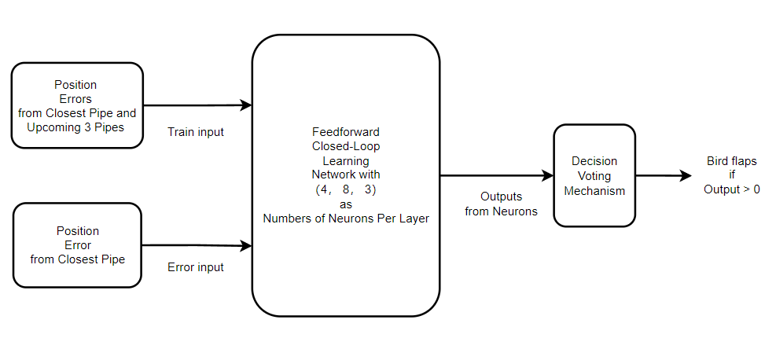
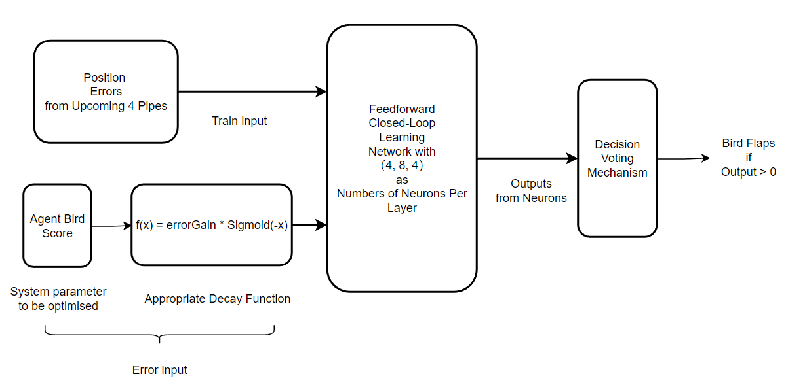
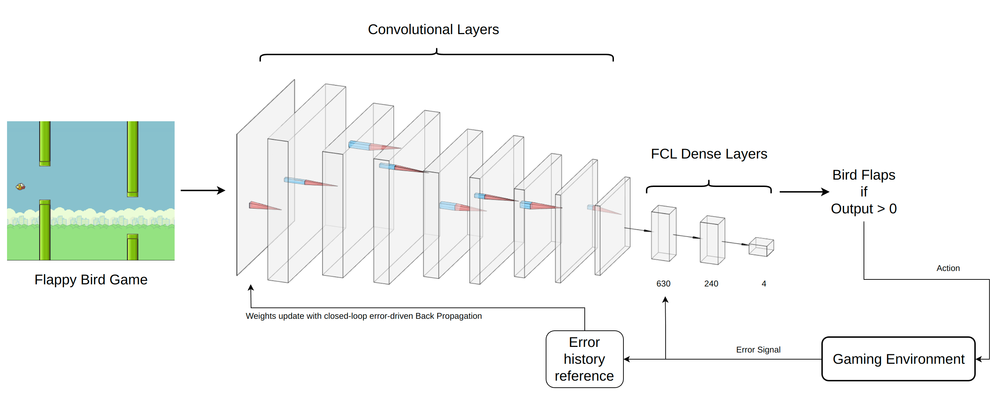
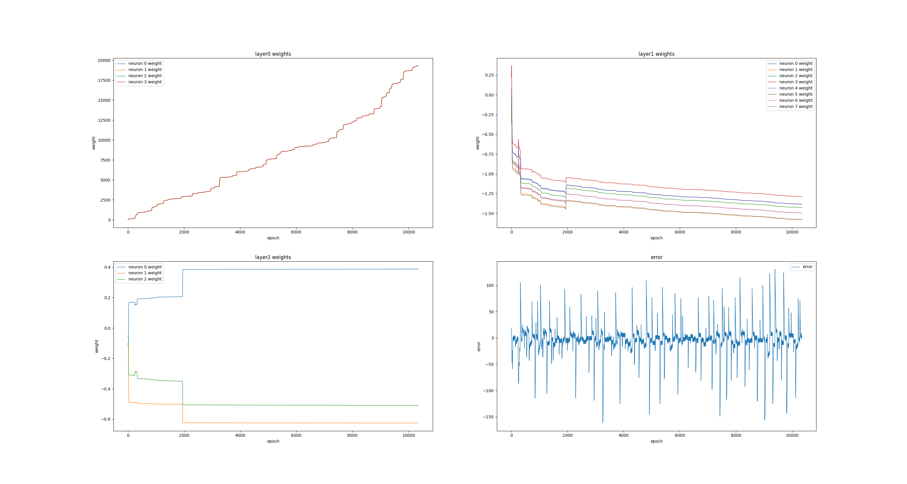
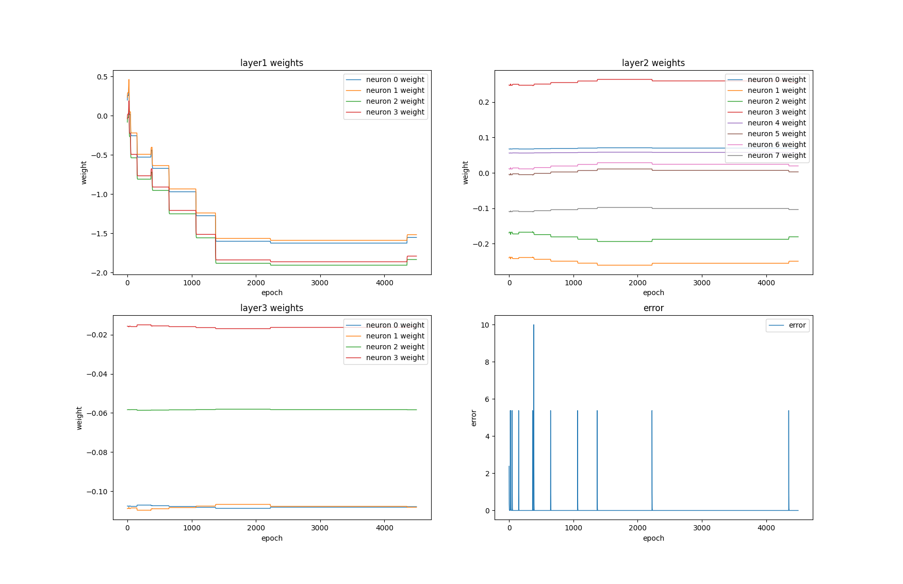
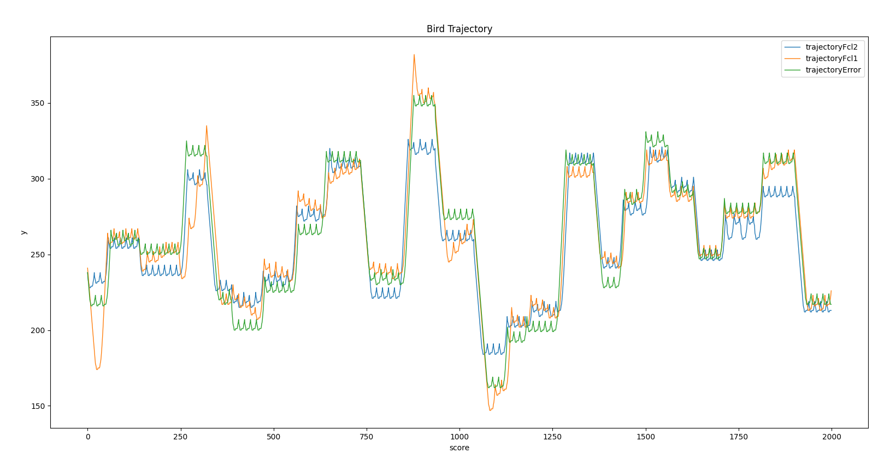
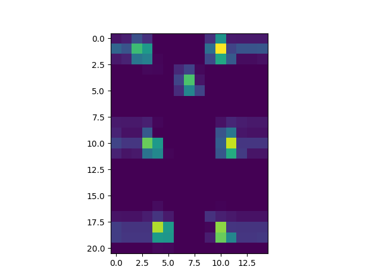
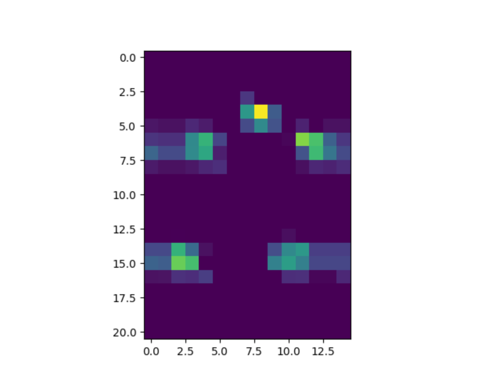
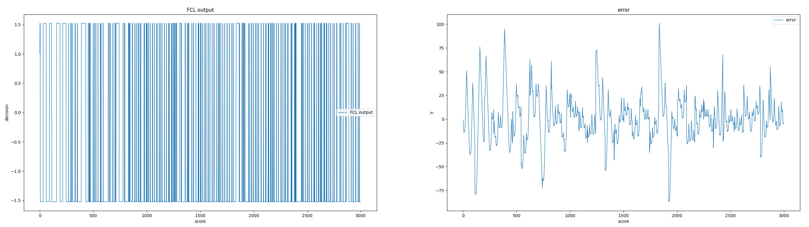

# FCLappyBird: Adaptive Agent Behavior Control Based on Feedforward Close-Loop Learning


#### (For futher details, please check the codes, which are well commented)

## Prerequisites
Python Coding enviroment with the libraries: pygame and feedforward-closedloop-learning and Pytorch (see below)

```
pip install pygame

pip install feedforward-closedloop-learning

```

# How to run:
## 1. Run the game benchmark enviroment
```
python main.py
```
## 2. Game control

Ctrtl + P: pause the game

Ctrl + 1: sets the frame rate of the game to the default value.

Ctrl + 2: sets the frame rate of the game to half of the default value.

Ctrl + 3: sets the frame rate of the game to 10 times of the default value.

Ctrl + 4: creates a human player controlled bird (if you really want to complete with the agent bird).

Space: makes the bird jump for human player controlled bird.

# AI Agents which can be used to play the game
(For futher details, please check the codes, which are well commented)
THe enviroment can be used to test different AI agents. The following agents are available:
## 1. FCLNet driven by position errors

The error signal is defined as the error between the bird's height and the height of the front pipe's gap center
and the environment informations used to train the FCLNet are the errors signals of nearest 4 front pipes.   

if you want to use this agent, please uncomment
```
# from fcl import * 
```
in the game.py file and comment
```
from fcl2 import * 
```
and also ,change the following code in the game.py file
```
    def _agent_action(self):
        # in all birds, if a bird is not controlled by the human player,
        # then try to make the bird jump. This part is the operation part of the AI bird.
        for bird in self.birds:
            if bird is not self._human_bird:
                self.fcl2_flap(bird)# fcl_flap, fcl2_flap, fclappy_vision_flap
```
to
```
    def _agent_action(self):
        # in all birds, if a bird is not controlled by the human player,
        # then try to make the bird jump. This part is the operation part of the AI bird.
        for bird in self.birds:
            if bird is not self._human_bird:
                self.fcl_flap(bird)# fcl_flap, fcl2_flap, fclappy_vision_flap
```
and the learing rate should also be changed, which can be found in the config.py file


## 2. FCLNet Driven by abstract error

The error signal is defined as to maximize the score which bird can get. 
The enviroment informations used to train the FCLNet are the errors of nearest front 4 pipes.

## 3. DeepFCL with Convolutional layers

The working principle of DeepFCL is as follows: Firstly, the image signals are passed into the convolutional layers, where the parameters are in a preset state. As the depth of the convolutional layers increases, features from the image signals are extracted for the first time. Subsequently, the extracted features are fed as inputs into the dense layer formed by the FCL network, resulting in corresponding actions to interact with the environment. As a result of this interaction, error signals are transmitted back through the feedback loop into the network. As can be seen from the attached structural diagram, the error signal that reflects the system's state after the agent interacts with the environment, not only passes to the FCL dense layer as error input but also gets converted into the system's post-interaction state through the 'error history reference' mechanism, and then is relayed to the convolutional layers to serve as a reference for adjusting filter parameters. The mechanism behind the 'error history reference' is that when the error expects a reduction due to the output of the FCL dense layer, it takes the current system state as the target state for the convolutional layer, passing it for learning. This way, it can better extract features of the system state when the error gets optimized. 

In this particular case, the approach involves storing the system state in a sequence when the error signal is below a certain value. Whenever a new state is saved, the oldest saved state is popped out. As a result, we obtain a continuously updated experience sequence related to error optimization (the length of this sequence correlates with the output of our convolutional layer), which guides the parameter updates of the convolutional layer itself. 

If you're interested, please check out the DeepFCL branch at https://github.com/Wikian233/FCLappyBird.git for more information.


# Results
## 1. FCLNet driven by position errors


## 2. FCLNet Driven by abstract error


## 3. Bird Trajectory comparison between FCLNet driven by position errors and FCLNet Driven by abstract error and simply error-based control 



## 4. DeepFCL with Convolutional layers



Features extracted by the convolutional layers of DeepFCL driven by closed-loop error-based experience history sequence.

It can be seen that the convolutional layers can successfully extract the features of the bird and the pipes' end points.

And the features of the bird and the pipes' end points are the most important features for the bird to make decisions.

(Especially considering how do we define the error signal,it is highly related to the bird's height and the pipes' end points)


Another example of features extracted by the convolutional layers of DeepFCL driven by closed-loop error-based experience history sequence.



DeepFCL Result in first 3000 learning steps

Due to the reseaon that the time for submission is limited, the DeepFCL is not fully trained, but it can still be seen that the DeepFCL can learn to play the game.

The further work is to slecet the appropriate hyperparameters and train the DeepFCL for a longer time. And also try to code it with GPU to speed up the training process.


